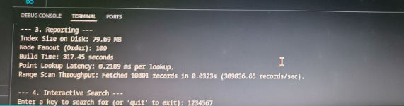

# Disk-Based B+ Tree Storage Engine

> Building a persistent indexing system capable of efficiently querying multi-gigabyte datasets without loading them entirely into memory.

<div align="center">


</div>

---

# Executive Summary

Modern databases and storage systems must efficiently manage datasets that far exceed available memory. Performing full-file scans for every query becomes increasingly impractical as data volume grows, resulting in poor performance and excessive disk I/O.

This project implements a **disk-backed B+ Tree indexing engine** designed to support efficient querying of large-scale datasets while maintaining a minimal memory footprint.

Rather than loading an entire dataset into RAM, the system creates a persistent index stored on disk, allowing records to be located through a small number of page accesses. The implementation supports:

- Fast point lookups
- High-throughput range scans
- Persistent storage
- Incremental updates
- Large-scale indexing

The resulting system demonstrates the core indexing principles used internally by modern database engines such as MySQL, PostgreSQL, SQLite, and many distributed storage systems.

---

# Key Achievements

✔ Built a fully disk-backed B+ Tree index

✔ Indexed a multi-gigabyte dataset exceeding available memory

✔ Implemented persistent page-based storage

✔ Supported efficient point lookups and range queries

✔ Achieved over **300,000 records/sec** range scan throughput

✔ Successfully inserted and verified new records after index construction

✔ Designed leaf-level sibling links for efficient sequential traversal

✔ Demonstrated practical database indexing principles used in production systems

---

# Problem Statement

As datasets grow beyond available memory, traditional in-memory data structures become insufficient.

A naïve query strategy requires scanning every record in the dataset to locate matching values:

```text
Query
   ↓
Read Entire Dataset
   ↓
Find Matching Record
```

This approach becomes prohibitively expensive for large-scale systems.

Modern databases solve this problem using indexing structures that provide direct access paths to records.

This project implements a persistent B+ Tree indexing system capable of:

- Locating records without full-file scans
- Supporting efficient updates
- Maintaining low memory usage
- Enabling fast range-based retrieval

---

# Why B+ Trees?

B+ Trees are among the most widely used indexing structures in database systems.

Examples include:

- MySQL InnoDB
- PostgreSQL
- SQLite
- Microsoft SQL Server
- Oracle Database

The structure is specifically optimized for disk-based storage.

### Advantages

- High fanout reduces tree height
- Few disk accesses per lookup
- Efficient range scans
- Sequential leaf traversal
- Excellent scalability for large datasets

Unlike binary search trees, B+ Trees are designed around disk access patterns rather than CPU operations.

---

# Dataset

The indexing engine was tested on a large-scale dataset containing millions of records.

Each record consists of a key-value pair used to construct the persistent index.

Because the dataset size exceeded available memory, the implementation relied entirely on disk-backed structures for storage and retrieval. :contentReference[oaicite:0]{index=0}

---

# System Architecture

The indexing pipeline follows four stages:

```text
Raw Dataset
      │
      ▼
Binary Conversion
      │
      ▼
Disk-Based B+ Tree Construction
      │
      ▼
Persistent Index File
      │
      ▼
Point Lookups / Range Scans / Updates
```

---

# Methodology

## Step 1 — Binary Data Conversion

The original dataset was first converted from CSV format into a binary representation.

### Why?

CSV processing introduces significant parsing overhead.

Binary storage provides:

- Faster reads
- Reduced parsing cost
- Lower processing latency
- Better compatibility with page-based indexing

This preprocessing step created the dataset used during index construction. :contentReference[oaicite:1]{index=1}

---

## Step 2 — Index Construction

The B+ Tree index was constructed incrementally over a large-scale dataset containing hundreds of millions of records.

The indexing process continuously processed records, created internal nodes, managed page allocations, and maintained balanced tree properties while persisting data to disk.

The screenshot below shows the index construction phase actively processing dataset records.


### Observations

- Successfully processed hundreds of millions of records.
- Maintained low memory usage through disk-backed storage.
- Persisted nodes directly to disk during construction.
- Built a large-scale index without requiring the full dataset in memory.

This demonstrates one of the key advantages of storage-engine-style architectures: scalability beyond available RAM.
---

## Step 3 — Point Lookups

The system supports direct key-based searches.

Workflow:

```text
Search Key
     │
     ▼
Root Node
     │
     ▼
Internal Nodes
     │
     ▼
Leaf Node
     │
     ▼
Record Location
```

After index construction, the system enters interactive search mode, allowing arbitrary key-based lookups against the persistent index.

The screenshot below demonstrates multiple successful searches.


### Lookup Characteristics

- Direct key-based retrieval
- Millisecond-level search latency
- Traversal through a shallow B+ Tree structure
- Efficient disk-based record location

Because of the high fanout of the B+ Tree, only a small number of page accesses are required to locate records.

This behavior closely resembles the indexing mechanisms used by modern database systems.

---

## Step 4 — Range Scans

One of the primary advantages of B+ Trees is efficient sequential traversal.

Leaf nodes maintain right-sibling links:

```text
Leaf 1 → Leaf 2 → Leaf 3 → Leaf 4
```

This allows large record ranges to be retrieved without repeatedly traversing the tree.

---

## Step 5 — Updates

The index supports insertion of new key-value pairs after construction.

Inserted records were verified through subsequent searches to ensure index consistency and correctness. :contentReference[oaicite:3]{index=3}

---

# Performance Results

The following measurements were recorded during execution.

| Metric | Result |
|----------|---------|
| Dataset Type | Multi-Gigabyte Dataset |
| B+ Tree Order (Fanout) | 100 |
| Index Size on Disk | 7.921 GB |
| Index Construction Time | 3174.5 Seconds |
| Range Scan Throughput | 309,836 Records/sec |
| Update Support | Verified |

The screenshot below shows the recorded performance statistics.



### Analysis

#### High Fanout

A fanout of 100 significantly reduces tree height, minimizing disk accesses during search operations.

#### Fast Point Queries

Average lookup latency remained below one millisecond, demonstrating the effectiveness of the indexing structure.

#### Efficient Range Retrieval

Leaf-level sibling links enabled sequential scanning at over 300,000 records per second.

#### Compact Index Representation

The disk-backed structure maintained a relatively compact storage footprint while supporting efficient retrieval operations.

These results highlight why B+ Trees remain the dominant indexing structure in modern database systems.

---

# Engineering Concepts Demonstrated

## Database Internals

Understanding how database engines organize and retrieve records efficiently.

## Persistent Storage Structures

Building data structures that survive program execution and remain stored on disk.

## Page-Oriented Design

Managing information through fixed-size disk pages rather than in-memory objects.

## Indexing Systems

Constructing efficient access paths for large-scale datasets.

## Range Query Optimization

Leveraging linked leaf nodes to accelerate sequential scans.

## Performance Engineering

Analyzing build time, lookup latency, and retrieval throughput.

## Large-Scale Data Processing

Operating on datasets larger than available memory.

---

# Real-World Applications

The concepts explored in this project are directly applicable to:

- Database Management Systems
- Search Engines
- Storage Engines
- Key-Value Stores
- Analytics Platforms
- Data Warehouses
- Log Processing Systems
- Distributed Databases
- File Systems

Virtually every large-scale database relies on indexing structures similar to B+ Trees.

---

# Installation

## Clone Repository

```bash
git clone https://github.com/Astro-Phile/disk-based-bplus-tree-index.git

cd disk-based-bplus-tree-index
```

## Install Dependencies

```bash
pip install -r requirements.txt
```

---

# Running the Project

## Step 1 — Convert Dataset

```bash
python convert_to_dat.py
```

This generates:

```text
dataset.dat
```

---

## Step 2 — Build Index and Run Benchmarks

```bash
python main.py
```

The program will:

- Build the disk-based B+ Tree
- Measure construction performance
- Execute point lookup tests
- Execute range scan benchmarks
- Verify updates
- Enter interactive search mode

As documented in the project report. :contentReference[oaicite:5]{index=5}

---

# Skills Demonstrated

Database Systems • Storage Engines • B+ Trees • Persistent Data Structures • Indexing • File Systems • Large-Scale Data Processing • Performance Engineering • Data Structures • Disk-Based Algorithms • Query Optimization • Systems Programming • Python

---

# What This Project Demonstrates

This project showcases the ability to:

- Design persistent indexing structures
- Build storage-efficient systems
- Work with datasets larger than available memory
- Optimize lookup and retrieval performance
- Implement database-inspired architectures
- Analyze system-level performance characteristics
- Apply theoretical data structure concepts to real-world engineering problems

Rather than focusing solely on data analysis, this project explores the infrastructure that enables large-scale data systems to operate efficiently.

---

# Learning Outcomes

One of the most important lessons in database engineering is that data access is often more expensive than computation.

The B+ Tree addresses this challenge by minimizing disk accesses while preserving efficient search and traversal operations.

This project demonstrates how modern storage engines transform expensive full-file scans into efficient indexed retrieval operations, enabling scalable performance on datasets that would otherwise be impractical to query.

---

# Author

**Aditya Kashyap**

B.Tech Artificial Intelligence & Data Science  
Indian Institute of Technology Jodhpur

Data Engineering • Database Systems • Machine Learning • Analytics Engineering
